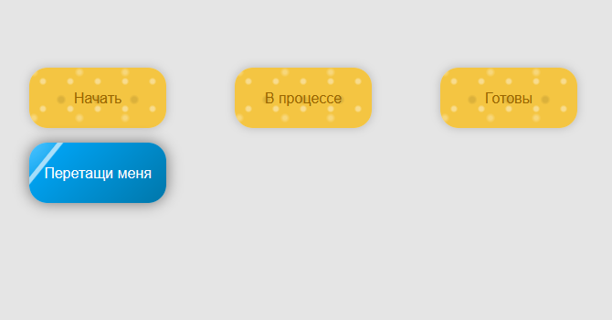

# Здесь собраны несколько интересных работ написанные с помощью JavaScript

## 1. Интерактивная галерея
Этот проект представляет собой стильную веб-страницу с интерактивными карточками. Каждая 
карточка оживает при клике, плавно разворачиваясь и акцентируя внимание на имени персонажа.

### Основные особенности:
- Интерактивные карточки: Кликните на карточку, чтобы увидеть персонажа крупным планом.
- Адаптивный дизайн: Идеально смотрится на любых устройствах — от мобильных телефонов до настольных компьютеров.
- Поддержка сенсорных устройств: Переключайтесь между карточками с помощью свайпов.
- Кроссбраузерная совместимость: Гарантирована стабильная работа в различных браузерах, 

#### Изначальный вид галереи

#### При просмотре фото

## 2. Drag-and-Drop

Проект представляет собой простую реализацию функции drag-and-drop 
(перетаскивания и размещения) с использованием встроенных возможностей HTML5 и 
JavaScript. Пользователь может перетаскивать элемент с классом .item между тремя 
различными зонами (плейсхолдерами) на странице.

